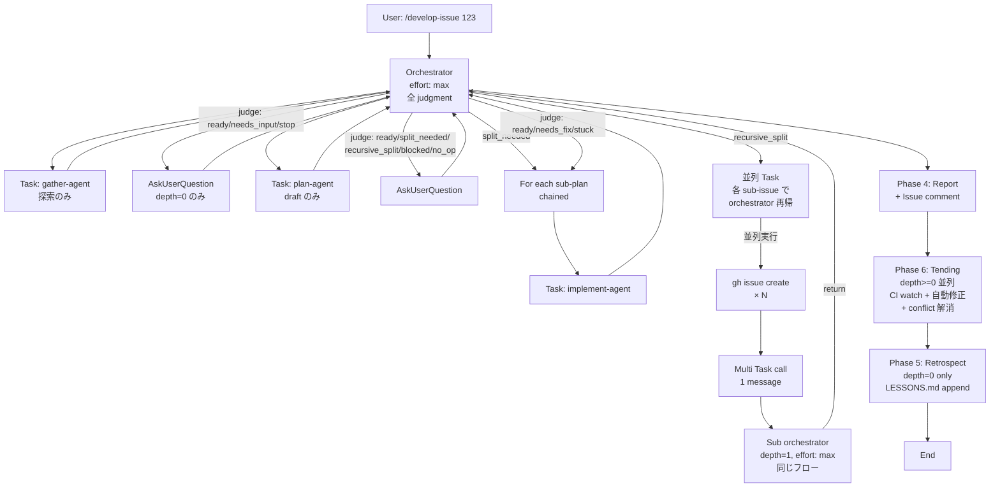

# develop-issue Skill: Overview

任意の git リポジトリで動作する Claude Code Skill。GitHub Issue 1 つを引数で受け取り、Issue 読解 → 計画 → 実装 → review → DRAFT PR まで自律実行する。人間の責務は「Issue の受け入れ基準提示」と「最終 PR review」に絞られる。リポジトリ固有の規約・コマンドは対象 repo の `CLAUDE.md` / `package.json` / `Makefile` / `.github/workflows` から動的抽出するためハードコードしない。

姉妹 docs:
- [phases.md](./phases.md) — Phase 1-5 の責務と入出力
- [design-decisions.md](./design-decisions.md) — load-bearing な設計判断の why
- [sources.md](./sources.md) — Anthropic 公式 + 設計根拠の一次ソースリンク集

---

## 1. 3 層アーキテクチャ

| 層 | 配置 | 責務 |
|---|---|---|
| **Orchestrator** | `SKILL.md` (`effort: max`) | 全 judgment、Phase 遷移、Task 起動、AskUserQuestion、state.json 管理 |
| **Phase agent** | `agents/{gather,plan,implement,retrospect}-agent.md` | heavy task の context 分離専用。生データ生成 / draft / 実行 / 要約 return。**判定はしない** |
| **Judgment mandate** | `references/{gather,plan,code,pr-body}-judgment.md` | orchestrator が判断時に Read する評価観点ドキュメント |

**generator≠evaluator**: phase agent (generator) と orchestrator (evaluator) を分離。orchestrator は要約だけ見て判定、heavy command (build / test / git mutation) は agent に委譲する。判定の一貫性 (1 つの brain で全 decisions) と context 分離 (生 token を agent に閉じ込め) の両立。

---

## 2. データフロー



---

## 3. State directory

各 (sub-)issue は `<repo>/.claude/tmp/impl-<id>/` に独立 state dir を持つ。

```
state.json                         # phase 進捗、verdict、sub_plans、verify_summary
repo-profile.md / .json            # 対象 repo の規約 / コマンド / LSP / noise paths / codebase_map
context.md                         # gather-agent が要約した実装文脈
qa-trail.md                        # 全 Q&A 履歴
plan.md / sub-plan-N.md            # plan-agent draft
gather-judgment-*.md               # orchestrator の判定記録
plan-judgment-*.md
code-judgment-*.md
pr-body-judgment-*.md
diff-summary-N-r<round>.txt        # implement-agent → orchestrator への要約
pr-urls.md                         # 作成済み PR 集約
retrospect.md                      # Phase 5 出力
(depth>0 のみ) parent-link.json    # {parent_issue, parent_state_dir, recursion_depth}
```

**Truth ordering**: git branch / filesystem (state dir 内ファイル) / state.json の順で信頼。state.json が古くても git/filesystem が正。Resume はこの順で確認する。

---

## 4. Entry-point map (改修時の読み順)

1. **`SKILL.md`** — orchestrator entry。全 phase の dispatch logic、hard rules、Pre-flight (LESSONS read)
2. **`references/orchestration.md`** — state machine、Phase 進行 pseudocode、state.json schema、定数値 (`MAX_DEPTH` 等)、Resume 戦略、AskUserQuestion 構築ルール、Phase 4 issue comment 仕様
3. **`references/{gather,plan,code,pr-body}-judgment.md`** — 該当判定 mandate (observable checklist)
4. **`references/return-schemas.md`** — sub-agent return JSON 契約 (status enum)
5. **`references/repo-profile-schema.md` / `repo-profile-extraction.md`** — 動的抽出する repo 情報の schema と抽出ヒューリスティック
6. **`references/retrospect.md`** — Phase 5 mandate
7. 該当 `agents/{role}-agent.md` — phase agent の prompt
8. **`LESSONS.md`** (`Status: pending` の最新 20 件) — 過去の失敗 / 成功パターン。Pre-flight で必ず Read

---

## 5. 配置と起動

- **配置**: `~/.claude/skills/develop-issue/` (Personal skill)、任意のリポジトリで動く
- **起動**: `/develop-issue <issue-number-or-url>`。`disable-model-invocation: true` で副作用 (branch 作成 / PR 作成) があるため Claude 自動起動は禁止、user の明示起動のみ
- **必須ツール**: `gh` (認証済み) / `git`、Claude Code 環境 (Task / AskUserQuestion 必須)

---

## 6. 非ゴール (skill が意図的にやらないこと)

拡張提案時にここを逸脱すると設計が崩れる境界 (詳細 hard rules は [SKILL.md](../SKILL.md) "Hard rules")。

- **migration ファイル生成**: 人間担当 (`repo-profile.conventions.human_owned` で除外、D4 と整合)
- **`gh pr merge` / `git push --force` (lease なし) / `--no-verify`**: safety hard rule、いかなる verdict でも実行禁止
- **main / default branch への直接 commit / push / force push**: 常に新ブランチ + DRAFT PR、`--force-with-lease` も default branch 禁止
- **依存先の別 issue を自動で着手**: skill は引数 1 issue + そこから派生した sub-plan のみ扱う
- **recursion depth 3 以上**: depth=2 で chained PR fallback (D7、無限再帰防止)
- **リポジトリ固有のロジック/ツール名のハードコード**: 全て `repo-profile` から動的抽出 (D4 の真逆)
- **PR merge 後の post-merge tracking** (deploy 監視 / production CI / rollback): Phase 6 (Tending) は merge 前の CI green + no-conflict 維持まで。merge 後は別 skill or 人間担当
- **CI flaky 自体の根本対応** (test infrastructure 改善 / 設計修正): Phase 6 は「flaky 疑いを検出して handoff」止まり、根本 fix は人間 / 別 skill
- **依存パッケージの自動 upgrade**: security scan fail / dependency drift は Phase 6 で handoff、`npm audit fix` / `cargo update` は影響範囲広く skill 範疇外
