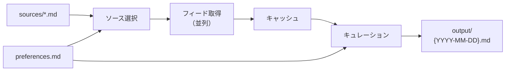

# news

Claude Code のスキル機能を使ったニュースキュレーションツール。複数のニュースソースから記事を自動取得し、ユーザーの好みに基づいてキュレーションする。

## 使い方

[Claude Code](https://docs.anthropic.com/en/docs/claude-code) でこのリポジトリを開き、`/curate-news` を実行する。

```
$ claude
> /curate-news
```

好みに合った記事が10件程度、日本語でキュレーションされる。

## 仕組み



1. **ソース選択** — `preferences.md` の興味・関心と各ソースのトピックをマッチングし、取得対象を自動選択
2. **フィード取得** — 対象フィードを subagent で並列取得。キャッシュが有効（TTL内）ならスキップ
3. **キュレーション** — 全記事を統合・重複排除し、興味との関連度とスコアで通常枠8件＋ワイルドカード枠2件を選定
4. **出力** — 日本語のマークダウン形式で表示し、`output/{YYYY-MM-DD}.md` に保存

## ニュースソース

22ソースが定義済み。各ソースは `sources/*.md` に独立したファイルとして管理されている。

| ソース | カテゴリ | 説明 |
|--------|----------|------|
| [Ars Technica](https://arstechnica.com/) | テック | 深掘り技術記事の老舗メディア |
| [dev.to](https://dev.to/) | テック | 開発者コミュニティ。チュートリアル・技術記事 |
| [GitHub Trending](https://github.com/trending) | テック | GitHubのトレンドリポジトリ * |
| [Hacker News](https://news.ycombinator.com/) | テック | Y Combinator運営のテック系ニュース |
| [InfoQ](https://www.infoq.com/) | テック | ソフトウェアアーキテクチャ特化メディア |
| [Lobsters](https://lobste.rs/) | テック | 招待制のテック系コミュニティ |
| [MIT Technology Review](https://www.technologyreview.com/) | テック | AI・バイオ・量子等の先端技術 |
| [Product Hunt](https://www.producthunt.com/) | テック | 新プロダクト発見プラットフォーム |
| [Reddit](https://www.reddit.com/) | テック | テック系サブレディット |
| [TechCrunch](https://techcrunch.com/) | テック | 米国最大のテックメディア |
| [The Verge](https://www.theverge.com/) | テック | テック・科学・エンタメの大手メディア |
| [Wired](https://www.wired.com/) | テック | テクノロジーと文化・社会の交差点 |
| [日経新聞](https://www.nikkei.com/) | 経済 | 日本最大の経済紙（速報フィード） |
| [Nature](https://www.nature.com/) | 科学 | 世界最高峰の学術ジャーナル |
| [Science](https://www.science.org/) | 科学 | AAAS発行のトップ学術ジャーナル群 |
| [Dribbble](https://dribbble.com/) | デザイン | デザイナー向けコミュニティ（Stories記事） |
| [GIGAZINE](https://gigazine.net/) | 日本語 | テック・科学・エンタメの老舗ニュースサイト |
| [ITmedia](https://www.itmedia.co.jp/) | 日本語 | エンタープライズIT・AI・セキュリティ |
| [Publickey](https://www.publickey1.jp/) | 日本語 | エンタープライズIT専門メディア |
| [Qiita](https://qiita.com/) | 日本語 | エンジニア向け技術記事共有プラットフォーム |
| [はてなブックマーク](https://b.hatena.ne.jp/) | 日本語 | 日本最大のソーシャルブックマーク |
| [Zenn](https://zenn.dev/) | 日本語 | エンジニア向け技術情報プラットフォーム |

\* GitHub Trending はサードパーティの [GitHubTrendingRSS](https://github.com/mshibanami/GitHubTrendingRSS) 経由で取得

**検討したが対応不可のソース**: Bloomberg（公開RSSフィード無し）、Designer News（サイト閉鎖済み）

## カスタマイズ

### 好みの設定

`.claude/skills/curate-news/preferences.md` を編集する。

```markdown
# ニュースの好み（例）

## 興味・関心

- iOS / Swift 開発
- AI / LLM

## 品質基準

- 読んで新しい学びや発見がありそうな記事を優先
- 宣伝色の強い記事は避ける
```

興味・関心はソースのカテゴリ自動選択にも使われるため、具体的に書くとより精度が上がる。

### ソースの追加

`sources/` にマークダウンファイルを追加する。フォーマットは `STYLEGUIDE.md` を参照。

## ファイル構成

```
.claude/skills/curate-news/
├── SKILL.md           # ワークフロー定義
├── STYLEGUIDE.md      # 設計方針・ファイル構成ガイド
├── preferences.md     # ユーザーの好み
├── sources/           # ニュースソース定義
├── cache/             # フィード取得キャッシュ（git管理外）
└── output/            # キュレーション結果（git管理外）
```
