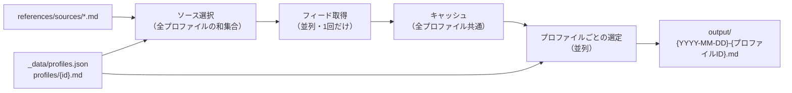
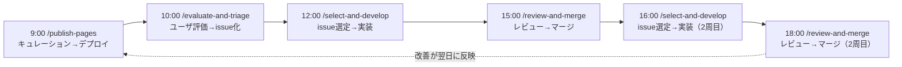

# news

Claude Code のスキル機能を使ったニュースキュレーションツール。複数のニュースソースから記事を自動取得し、読者プロファイル（好み）ごとに別々のフィードとしてキュレーションする。

キュレーション結果の例は [GitHub Pages](https://ha1f.github.io/news/) で確認できる。フィードは3つ公開している。

| フィード | 読者像 | ページ |
|---------|-------|-------|
| テック・経済 | エンジニア。技術と経済の重要ニュースを毎朝10分で | [/](https://ha1f.github.io/news/) |
| やさしい時事 | 通勤中のライト読者。前提知識なしで世の中に追いつく | [/feeds/commuter/](https://ha1f.github.io/news/feeds/commuter/) |
| 子育て | 子育て中の読者。制度・研究・暮らしの工夫 | [/feeds/parenting/](https://ha1f.github.io/news/feeds/parenting/) |

## 使い方

[Claude Code](https://docs.anthropic.com/en/docs/claude-code) でこのリポジトリを開き、`/curate-news` を実行する。

```
$ claude
> /curate-news
```

全プロファイル分のキュレーションが走り、既定プロファイル（テック・経済）の結果が日本語で表示される。

結果はローカルの `output/{YYYY-MM-DD}-{プロファイルID}.md` に保存される。Webで公開したい場合は `/publish-pages` を使う。キュレーションの実行からPR作成まで自動で行われ、PRをマージすると [GitHub Pages](https://ha1f.github.io/news/) の各フィードに反映される。

## 仕組み


```mermaid
flowchart LR
    sources["references/sources/*.md"] --> select["ソース選択\n（全プロファイルの和集合）"]
    profiles["_data/profiles.json\nprofiles/{id}.md"] --> select
    select --> fetch["フィード取得\n（並列・1回だけ）"]
    fetch --> cache["キャッシュ\n（全プロファイル共通）"]
    cache --> curate["プロファイルごとの選定\n（並列）"]
    profiles --> curate
    curate --> output["output/\n{YYYY-MM-DD}-{プロファイルID}.md"]
```

1. **ソース選択** — 全プロファイルの興味・関心と各ソースのトピックをマッチングし、取得対象を自動選択
2. **フィード取得** — `scripts/fetch_feeds.py` で対象フィードを並列取得。キャッシュが有効（TTL内）ならスキップ。取得と要約の共通処理はプロファイルが増えても1回のまま
3. **キュレーション** — プロファイル1件につき subagent 1つを並列に走らせ、その好みで選定する。掲載履歴の重複判定もプロファイルごとに独立
4. **出力** — 日本語のマークダウン形式で `output/{YYYY-MM-DD}-{プロファイルID}.md` に保存

## 毎日の自動ループ

claude.ai のクラウド trigger が毎日のステージを実行し、キュレーション→評価→実装→マージまで自動で回る。9時の publish は全フィード分の記事を1つの PR にまとめ、10時の評価はその日のペルソナが読むフィードを見る。スキル・プロンプトの改善 PR も自動マージされる自己改善ループ。実装→レビューは1日2周（12時→15時、16時→18時）。スキルの優先順（要対応の in_progress → backlog）により、15時に要修正で draft に戻った PR は16時の run が最優先で拾い、手戻りを翌日に持ち越さない。

各ステージは終了時に status issue へトークン消費を記録する（`.claude/scripts/session_usage.py` が実行中セッションの記録を集計する）。週次の監査がこれを並べて、消費が伸び続けているステージを拾う。

週次（日曜11時）の `/audit-and-adopt` は、プロダクトでなくループ自身の環境を監査する: マージ済み資産の批評・エコシステム（Claude Code 新機能・公式スキル）の取り込み判断・スキル手順が守られているかのプロセス監査。見つかった改善は issue / PR として日次ループに流れ込む。


```mermaid
flowchart LR
    publish["9:00 /publish-pages\nキュレーション→デプロイ"] --> evaluate["10:00 /evaluate-and-triage\nユーザ評価→issue化"]
    evaluate --> develop["12:00 /select-and-develop\nissue選定→実装"]
    develop --> review["15:00 /review-and-merge\nレビュー→マージ"]
    review --> develop2["16:00 /select-and-develop\nissue選定→実装（2周目）"]
    develop2 --> review2["18:00 /review-and-merge\nレビュー→マージ（2周目）"]
    review2 -.改善が翌日に反映.-> publish
```

状態は GitHub ネイティブのもので受け渡す: PR の **draft（作業中・ループは触らない）/ ready（レビュー・マージ候補）**、issue の open / closed、linked PR、作者。専用ラベルは `hold`（自動処理を止めて人間が見る）の1つだけ。数値上限・保護パス・auto-merge モードは [.claude/GUARDRAILS.md](.claude/GUARDRAILS.md) に集約されている。

### 介入方法（runbook）

- **PR を自動マージさせない** — draft のままにするか、`hold` ラベルを付ける（ready な PR はレビュー後にマージされ得る）
- **issue を自動実装させない** — `hold` ラベルを付ける
- **ループ全体を止める** — claude.ai の設定で該当 trigger を無効化する
- **悪い変更を巻き戻す** — `git revert` の PR を作ってマージする
- **自動マージの有効化 / 停止** — `.claude/GUARDRAILS.md` の mode を編集する（保護パスなので必ず人間がマージする）

### trigger 定義（claude.ai 上にあり repo 外のため記録）

| JST | cron (UTC) | メッセージ |
|-----|-----------|-----------|
| 9:00 | `0 0 * * *` | `/publish-pages` |
| 10:00 | `0 1 * * *` | `/evaluate-and-triage` |
| 12:00 | `0 3 * * *` | `/select-and-develop` |
| 15:00 | `0 6 * * *` | `/review-and-merge` |
| 16:00 | `0 7 * * *` | `/select-and-develop` |
| 18:00 | `0 9 * * *` | `/review-and-merge` |
| 日曜 11:00 | `0 2 * * 0` | `/audit-and-adopt` |

## 依存関係の更新

GitHub Actions と workflow 内でピン留めしているバージョン（Playwright・Python）は [Renovate](https://docs.renovatebot.com/) が更新する。設定は [.github/renovate.json5](.github/renovate.json5) で、Renovate 公式の `config:best-practices` をベースにしている。

- **digest 固定** — Actions は `@v7` のようなタグではなく commit SHA に固定される（タグは付け替え可能なため、サプライチェーン攻撃を受けにくくする）
- **実行タイミング** — 月曜早朝（JST）にまとめて PR を作る。日次ループのステージと重ならない時間帯
- **自動マージ** — digest / patch / minor は公開から3日経過し CI が green なら Renovate 自身がマージする。major と Renovate 設定自体の変更は人間がマージする
- **状況の確認** — Renovate が作る Dependency Dashboard issue で保留中の更新を一覧できる（bot の issue なのでループの実装対象・issue 上限には入らない）

有効化には [Renovate GitHub App](https://github.com/apps/renovate) のインストールが必要（リポジトリ設定のためリポジトリ外の作業）。Fork して使う場合も同様に、自分のリポジトリに App をインストールすると設定がそのまま効く。

## ニュースソース

22ソースが定義済み。各ソースは `references/sources/*.md` に独立したファイルとして管理されている。

| ソース | カテゴリ | 説明 |
|--------|----------|------|
| [Ars Technica](https://arstechnica.com/) | テック | 深掘り技術記事の老舗メディア |
| [dev.to](https://dev.to/) | テック | 開発者コミュニティ。チュートリアル・技術記事 |
| [GitHub Trending](https://github.com/trending) | テック | GitHubのトレンドリポジトリ * |
| [Hacker News](https://news.ycombinator.com/) | テック | Y Combinator運営のテック系ニュース |
| [InfoQ](https://www.infoq.com/) | テック | ソフトウェアアーキテクチャ特化メディア |
| [Lobsters](https://lobste.rs/) | テック | 招待制のテック系コミュニティ |
| [MIT Technology Review](https://www.technologyreview.com/) | テック | AI・バイオ・量子等の先端技術 |
| [Product Hunt](https://www.producthunt.com/) | テック | 新プロダクト発見プラットフォーム |
| [Reddit](https://www.reddit.com/) | テック | テック系サブレディット |
| [TechCrunch](https://techcrunch.com/) | テック | 米国最大のテックメディア |
| [The Verge](https://www.theverge.com/) | テック | テック・科学・エンタメの大手メディア |
| [Wired](https://www.wired.com/) | テック | テクノロジーと文化・社会の交差点 |
| [日経新聞](https://www.nikkei.com/) | 経済 | 日本最大の経済紙（速報フィード） |
| [Nature](https://www.nature.com/) | 科学 | 世界最高峰の学術ジャーナル |
| [Science](https://www.science.org/) | 科学 | AAAS発行のトップ学術ジャーナル群 |
| [Dribbble](https://dribbble.com/) | デザイン | デザイナー向けコミュニティ（Stories記事） |
| [GIGAZINE](https://gigazine.net/) | 日本語 | テック・科学・エンタメの老舗ニュースサイト |
| [ITmedia](https://www.itmedia.co.jp/) | 日本語 | エンタープライズIT・AI・セキュリティ |
| [Publickey](https://www.publickey1.jp/) | 日本語 | エンタープライズIT専門メディア |
| [Qiita](https://qiita.com/) | 日本語 | エンジニア向け技術記事共有プラットフォーム |
| [はてなブックマーク](https://b.hatena.ne.jp/) | 日本語 | 日本最大のソーシャルブックマーク（テクノロジー・政治経済・総合・暮らし・学び） |
| [Zenn](https://zenn.dev/) | 日本語 | エンジニア向け技術情報プラットフォーム |

\* GitHub Trending はサードパーティの [GitHubTrendingRSS](https://github.com/mshibanami/GitHubTrendingRSS) 経由で取得

**検討したが対応不可のソース**: Bloomberg（公開RSSフィード無し）、Designer News（サイト閉鎖済み）

## カスタマイズ

### 好みの設定

読者プロファイル1件が1つの好みファイルに対応する。既定プロファイルの好みは [`.claude/skills/curate-news/profiles/owner.md`](.claude/skills/curate-news/profiles/owner.md)。以下は例。

```markdown
# ニュースの好み

## 読者像

毎朝10分で「今日知っておくべきこと」を掴みたいソフトウェアエンジニア。専門用語はそのままで構わない。

## 興味・関心

- iOS / Swift 開発
- ソフトウェアアーキテクチャ
- AI / LLM
- 開発ツール・生産性
- テック業界の動向
- 話題のサービス・プロダクト
- 経済・ビジネス

## 好みのメディア

- 日経
- TechCrunch

## 読みたくない記事

- 入門・チュートリアル系の記事
- 宣伝色の強い記事

```

読者像は見出し・読みどころの言葉づかいの水準を決める。興味・関心はソースのカテゴリ自動選択にも使われるため、具体的に書くとより精度が上がる。

### フィード（読者プロファイル）の追加

好みとページの対応は [`_data/profiles.json`](_data/profiles.json) が唯一の定義で、キュレーション側（Python）とサイト側（Jekyll のテンプレート）が同じファイルを読む。追加する手順:

1. `_data/profiles.json` にエントリを足す（`id` / `post_slug` / `name` / `tagline` / `base`。既定フィードだけが `default: true` を持つ）
2. `.claude/skills/curate-news/profiles/{id}.md` に好みを書く
3. `feeds/{id}/` に `index.md` / `archive.md` / `feed.xml` を置く（既存フィードのファイルをコピーし、front matter の `profile` と `title` を変える）
4. `python3 .claude/skills/curate-news/scripts/profiles.py` で認識されることを確認する

記事は `_posts/{YYYY-MM-DD}-{post_slug}.md` に front matter の `profile` 付きで置かれ、そのフィードのトップ・アーカイブ・RSS にだけ載る。掲載履歴・重複判定もフィードごとに独立しているため、同じ記事が別フィードに載ってよい。

### ソースの追加

`references/sources/` にマークダウンファイルを追加する。フォーマットは `STYLEGUIDE.md` を参照。

## Forkして使う

自分専用のニュースキュレーションを作りたい場合は、リポジトリをForkして使う。

1. **Fork** — GitHubで [Fork](https://github.com/ha1f/news/fork) を作成し、ローカルにcloneする
2. **好みの編集** — `profiles/owner.md` を自分の興味・関心に書き換える（[書き方](#好みの設定)）。使わないフィードは `_data/profiles.json` と `feeds/{id}/` ごと削除する（[追加方法](#フィード読者プロファイルの追加)）
3. **ソースの調整** — 不要なソースを削除したり、読んでいるメディアを追加する（[追加方法](#ソースの追加)）
4. **GitHub Pagesの有効化** — リポジトリの **Settings → Pages** で Source を `main` ブランチに設定する。公開URLは `https://{ユーザー名}.github.io/news/` になる
5. **実行** — Claude Code で `/publish-pages` を実行し、PRをマージすれば公開される
6. **（任意）毎日の自動ループ** — [毎日の自動ループ](#毎日の自動ループ) を使う場合は、pinned の status issue（📊 daily-loop status）と `hold` ラベルを作成し、claude.ai で trigger を設定する（[trigger 定義](#trigger-定義claudeai-上にあり-repo-外のため記録)参照）。評価対象の URL は Pages API から自動解決される

## ファイル構成

```
.claude/scripts/        # ループ共通のスクリプト（セッションのトークン消費の集計など）
_data/profiles.json     # 読者プロファイル（フィード）の定義。Python と Jekyll の共通の情報源
_posts/                 # 公開済みの記事（{YYYY-MM-DD}-{post_slug}.md）
feeds/{id}/             # フィードごとのトップ・アーカイブ・RSS
_layouts/               # feed-home / feed-archive / feed-rss / post

.claude/skills/curate-news/
├── SKILL.md            # ワークフロー定義
├── STYLEGUIDE.md       # 設計方針・ファイル構成ガイド
├── profiles/{id}.md    # プロファイルごとの好み
├── scripts/            # プロファイル定義の読み込み・フィード取得
├── references/
│   ├── curation.md     # プロファイル1件分の選定手順（subagent に渡す）
│   └── sources/        # ニュースソース定義
├── cache/              # フィード取得キャッシュ（git管理外・全プロファイル共通）
└── output/             # キュレーション結果（git管理外）
```
